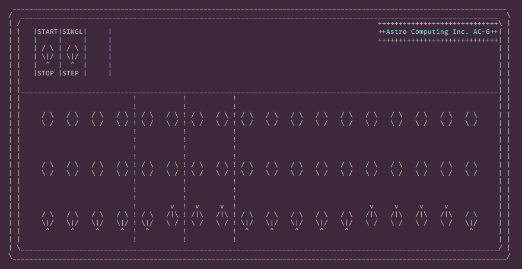

#Astro (I need a new name)

Astro should be a game about running a spaceship, powered by a small 
and weak CPU. I'm going for 0x10c but a couple decades back.

As of right now this repo is mostly for the AC-6 emulator I'm working
on, as well as the spec and guide in [manual.md](manual.md). The
CPU was originally 8-bit, although I'm just finishing up with making
it 12. It is heavily inspired by the DEC [PDP-8](https://en.wikipedia.org/wiki/PDP-8),
especially to do with opcode layout and memory paging.

I may add some more CPU designs, such as an obligatory 16-bit and
perhaps a PDP-10 style 36-bit.

Goals include:

* Fully defined AC-6 spec and emulator to match.
* Independent emulation code, with multiple frontends.
* Create and Debug programs using the CRIMP to toggle them in.
* Attach perpipherals like storage, printers, terminals, and more.
* Store spaceship control programs on Punch Cards/Tape Reels.

